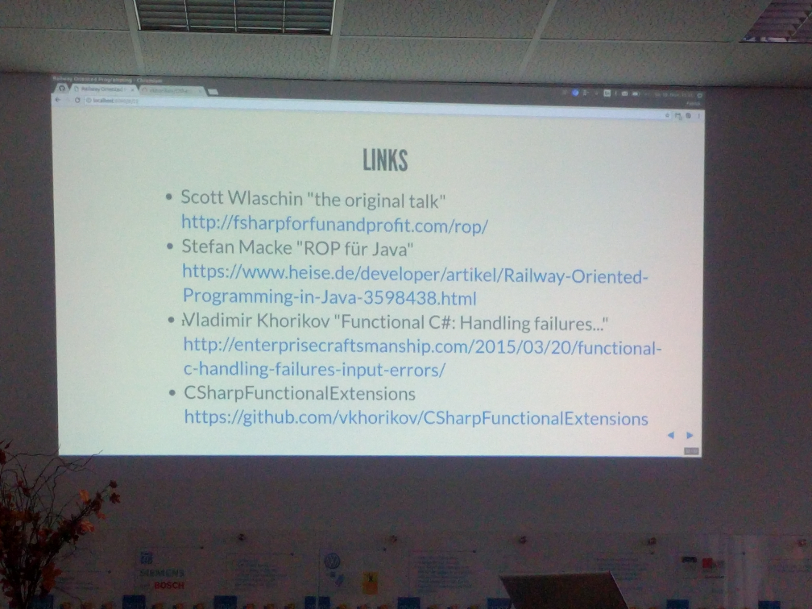

# Railway oriented programming

## blogs & talks
* Scott Wlaschin, talk about functional programming/monads
  * https://fsharpforfunandprofit.com/monadster/ ?!?
* http://fsharpforfunandprofit.com/posts/recipe-part2/ pretty much the same?
* https://fsharpforfunandprofit.com/rop

## literature
